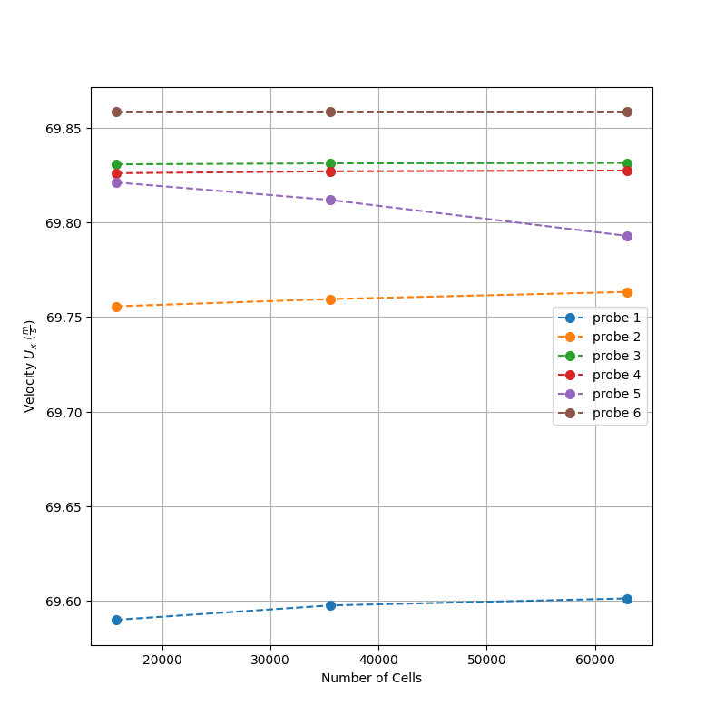
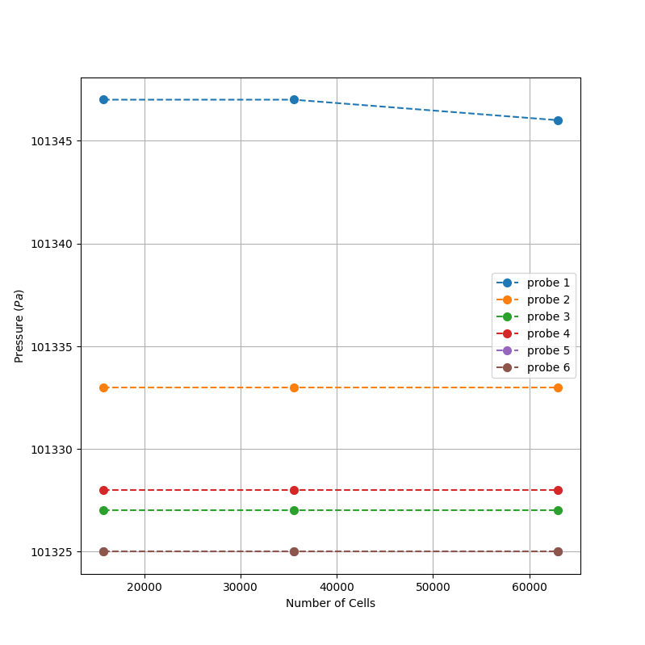
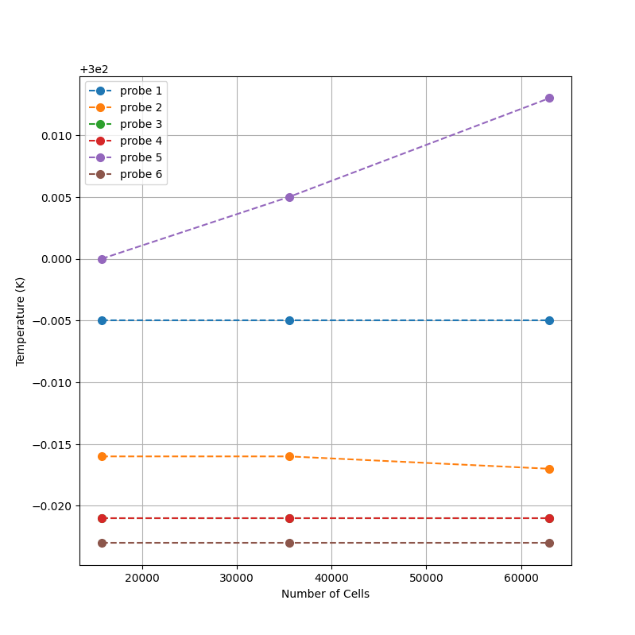

# Portfolio of Cenk Tekin CFD Projects

Introduction: This is a presentation of a number of CFD projects that I have been using to keep my skills up to date with advancements in OpenFOAM 13 and CFD in general.

### Error Calculation Methodology

In the following projects, using the methodology from (Roache, 2009), the calculation of the Grid Convergence Index (GCI) error is as follows:

1. **Calculate Representative Grid Sizes ($h$):** Generate three distinct meshes—coarse, medium, and fine—and compute the characteristic grid size ($h_1, h_2, h_3$) for each using the total domain area and total cell count:
   $$h = \sqrt{\frac{A_{\text{total}}}{N}}$$

2. **Determine Grid Refinement Ratios ($r$):** Calculate the refinement ratios between the grid pairs. It is highly recommended to keep these ratios above 1.3 to ensure the grid resolutions are distinct enough to capture discretization changes:
   $$r_{21} = \frac{h_2}{h_1}, \quad r_{32} = \frac{h_3}{h_2}$$

3. **Extract Solution Variables ($f$):** Run the CFD simulations and extract a critical target scalar variable (such as drag coefficient, lift coefficient, or peak velocity) from all three grids, yielding $f_1$ (fine), $f_2$ (medium), and $f_3$ (coarse).

4. **Solve for the Local Order of Accuracy ($p$):** Solve iteratively for the apparent order of accuracy ($p$) using the grid refinement ratios and the differences between the solutions:
   $$p = \frac{1}{\ln(r_{21})} \left| \ln\left| \frac{\epsilon_{32}}{\epsilon_{21}} \right| + q(p) \right|$$ 
   where $q(p) = \ln\left(\frac{r_{21}^p - s}{r_{32}^p - s}\right)$, $\epsilon_{32} = f_3 - f_2$, $\epsilon_{21} = f_2 - f_1$, and $s = 1 \cdot \text{sgn}\left(\frac{\epsilon_{32}}{\epsilon_{21}}\right)$.

5. **Calculate Relative Error ($\epsilon_{32}$ and $\epsilon_{21}$):** Determine the relative error between the two finest grids:
   $$\epsilon_{21} = \left| \frac{f_2 - f_1}{f_1} \right| \quad \text{and} \quad \epsilon_{32} = \left| \frac{f_3 - f_2}{f_2} \right|$$

6. **Compute the GCI Error:** Finally, calculate the fine- and medium-grid GCI error by applying a safety factor ($Fs$), which is typically set to 1.25 for a rigorous three-grid study: 
   $$\text{GCI}_{\text{fine}} = \frac{F_s \cdot \epsilon_{21}}{r_{21}^p - 1}$$

> **Note:** The resulting percentage represents your numerical uncertainty band. It quantifies how close your fine-grid solution is to the theoretical, asymptotic "grid-independent" solution.

## Subsonic Turbulent Boundary Layer over a Flat Plate with a Compressible Pressure Solver

In a convergent-divergent (CD) nozzle, a high-temperature, high-pressure subsonic flow is converted into a supersonic flow before being exhausted from the engine. A high-fidelity simulation must remain stable across two flow regimes (i.e., subsonic and supersonic) while capturing the boundary layer at the nozzle wall to determine quantities such as wall temperature. Using a density-based solver in the subsonic section of a CD nozzle makes it difficult to maintain stability. Therefore, a pressure-based solver is used to produce an internal field for that specific section of the nozzle (Ansys, 2026). Several assumptions are made for the nozzle simulation as a whole, which affect this validation unit case: the flow is chemically frozen, the cross-sectional area for the subsonic section is constant, and the flow is modeled as 2D axisymmetric. 

To validate the internal field produced by the pressure solver, a unit case study was conducted using zero-pressure-gradient flat-plate simulations in an incompressible (modeled as compressible), subsonic, turbulent air flow. The Spalart–Allmaras model, as a one-equation model, is computationally efficient for large mesh sizes, such as those used for CD nozzles. The NASA Turbulence Modeling Resource provides a validation case for my simulation to be compared against, which can be found at (AIAA TMRWG, 2026). The working fluid is air modelled as an ideal gas, using a reference temperature of 300 K and an inlet/freestream velocity which is found to be 69.522 m/s, corresponding to a Mach number of 0.2, matching the NASA TMR benchmark conditions. 

### Mesh and Boundary Conditions

*Figure 1: Mesh with a 175 x 90 resolution and its corresponding boundary conditions.*

The baseline mesh features a 175 by 90 grid size, with the boundary conditions shown in Figure 1. For these turbulence models, it is crucial that the mesh spacing near the wall remains under $y^+ = 1$ to fully resolve the viscous sublayer. Using the calculated $y$-coordinate value for $y^+ = 1$, I applied a simple expansion ratio to cluster the nodes closely along the $y$-axis. For the baseline mesh, the closest cell center to the wall was $1.4343 \times 10^{-5}$ meters.

For the grid independence study, a medium mesh was generated by multiplying the baseline mesh nodes by 1.5 in each direction, resulting in a 263 × 135 grid. For the fine mesh, the nodes were doubled in each direction relative to the baseline mesh, resulting in a grid size of 350 × 180. This yields refinement ratios of $r_{32} = 1.5$ and $r_{21} = 1.33$, both of which are above the recommended minimum refinement ratio of 1.1 (Roache, 2009). I chose these refinement sizes to be as efficient as possible while also being within the asymptotic range. 

This validation case was selected particularly because it shares similarities with the inlet boundary conditions of a CD nozzle. An inlet boundary for a CD nozzle requires one of the variables to float at the inlet to keep the throat choked (Anderson, 1995). Hence, total temperature and total pressure were chosen as the inlet boundary conditions, allowing the velocity to float. The total pressure and total temperature values were set using the case-specific ratios $p_t/p_{\text{ref}} = 1.02828$ and $T_t/T_{\text{ref}} = 1.008$, with $T_{\text{ref}} = 300\text{ K}$ and $p_{\text{ref}} = 101,325\text{ Pa}$. The outlet enforces a fixed static pressure matching the reference atmospheric value ($p/p_{\text{ref}} = 1$), while allowing velocity and temperature to float via zero-gradient conditions. 

The top patch boundary condition was set to freestream conditions using the reference velocity, pressure, and temperature values that were also applied to the internal field, thereby achieving a zero-pressure gradient along the $y$-axis. On the bottom surface, between the inlet and the plate, a symmetry condition is used to allow the freestream flow to make contact with the flat plate and enable the boundary layer to develop naturally. This is where the case slightly varies from a CD nozzle; in a nozzle, the inlet is located directly on a wall, meaning an initial turbulent boundary layer must be provided at the inlet. However, this validation case is used primarily to ensure that subsonic flows are correctly resolved by the solver setup. Finally, the flat plate has a no-slip velocity boundary condition, while temperature and pressure were set to zero-gradient. 

For the Spalart–Allmaras model, the inlet values were set to $\tilde{\nu} = 3\nu = 4.7 \times 10^{-5}\text{ m}^2/\text{s}$, while the derived turbulent kinematic viscosity ($\nu_t$) naturally updates based on the local $\tilde{\nu}$ transport field (Spalart and Allmaras, 1992). The internal field was initialized with $\tilde{\nu} = 4.7 \times 10^{-5}\text{ m}^2/\text{s}$, and this same value was used for the top freestream boundary condition. At the outlet, an inlet-outlet condition was specified using this value, which appears to avoid numerical instabilities. On the plate, the boundary condition was set to a fixed value of $0\text{ m}^2/\text{s}$. The parameter $\nu_t$ is calculated everywhere because of its dependence on $\tilde{\nu}$, with the exception of the plate surface, where its value is fixed to $0\text{ m}^2/\text{s}$.

### Verification
For verification, the residuals for velocity, pressure, and temperature were recorded to show that they met the convergence criteria, having dropped by at least three orders of magnitude and leveled out. Convergence criteria also dictate that the values of these quantities do not change for a steady-state flow; hence, several probes were placed in key locations, as shown in Table 1.

| Probe Number | Coordinates (x, y) |
| ------------ | ------------------ |
| 1            | 0.5, 0.025         |
| 2            | 0.5, 0.25          |
| 3            | 1, 0.025           |
| 4            | 1, 0.25            |
| 5            | 2, 0.025           |
| 6            | 2, 0.25            |

*Table 1: Probe locations within the domain.*

Probes 1 and 2 are positioned at the leading edge of the plate. This is where the wake forms as the flow hits the plate—a point of potential unsteady behavior—and is therefore worth monitoring to ensure that the values at those points stabilize. Probes 1, 3, and 5 are set 0.025 m from the wall. This ensures that the quantities are stable at two points within the log-law portion of the boundary layer (in the case of probes 3 and 5), and just above the leading edge to measure how the quantities are affected by the wake (in the case of probe 1). Probes 2, 4, and 6 are located in the freestream above the boundary layer to ensure that no unsteady behavior is occurring there and that the freestream values are maintained.

*Figure 2: Convergence history of velocity residuals for the SA model on the coarse mesh.*

*Figure 3: Convergence history of pressure residuals for the SA model on the coarse mesh.*

In Figures 2 and 3, it can be seen that the residuals have dropped and flatlined at 1e-05 for Ux, 1e-06 for Uy, and 1e-04 for pressure; hence, this meets the criteria for convergence for the coarse mesh. 

*Figure 4: Convergence history of velocity residuals for the SA model on the medium mesh.*

*Figure 5: Convergence history of pressure residuals for the SA model on the medium mesh.*

In Figures 4 and 5, it is visible that the residuals have dropped and averaged out at 1e-11 for Ux, 1e-09 for Uy, and 1e-07 for pressure; hence, this meets the criteria for convergence for the medium mesh. 

*Figure 6: Convergence history of velocity residuals for the SA model on the fine mesh.*

*Figure 7: Convergence history of pressure residuals for the SA model on the fine mesh.*

In Figures 6 and 7, the residuals have dropped to 1e-10 for Ux, 1e-08 for Uy, and 1e-07 for pressure, which have averaged out; hence, this meets the criteria for convergence for the fine mesh. However, as the order of magnitude did not perfectly flatline, it is important to show that the actual values stay consistent over the iterations. Figures 8–10 display the final values that each of the probes converged on by the end of the simulation, plotted against the number of cells used in the simulation. For all three variables, no significant change was found as the mesh was refined. 

*Figure 8: Velocity Probes.*

*Figure 9: Pressure Probes.*

*Figure 10: Temperature Probes.*

To understand the contribution of viscosity to the drag, the skin friction coefficient
