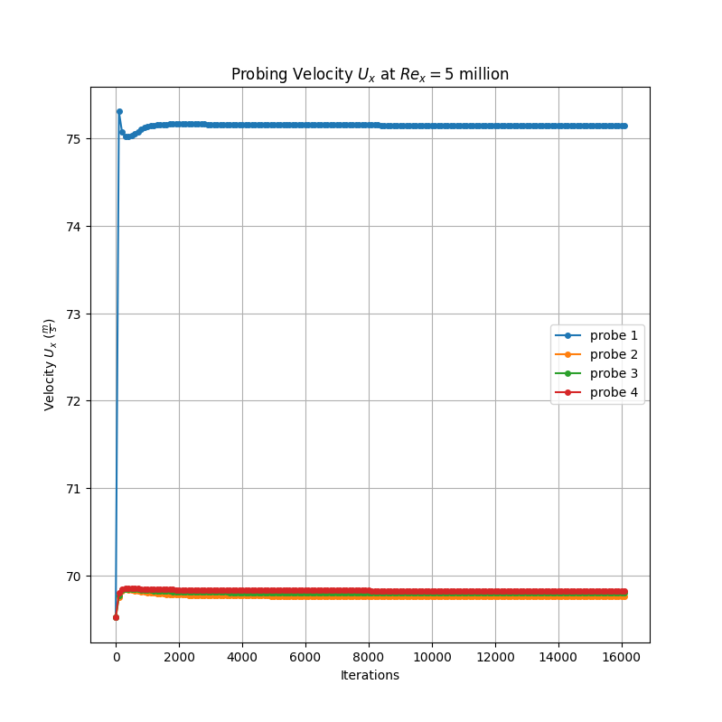
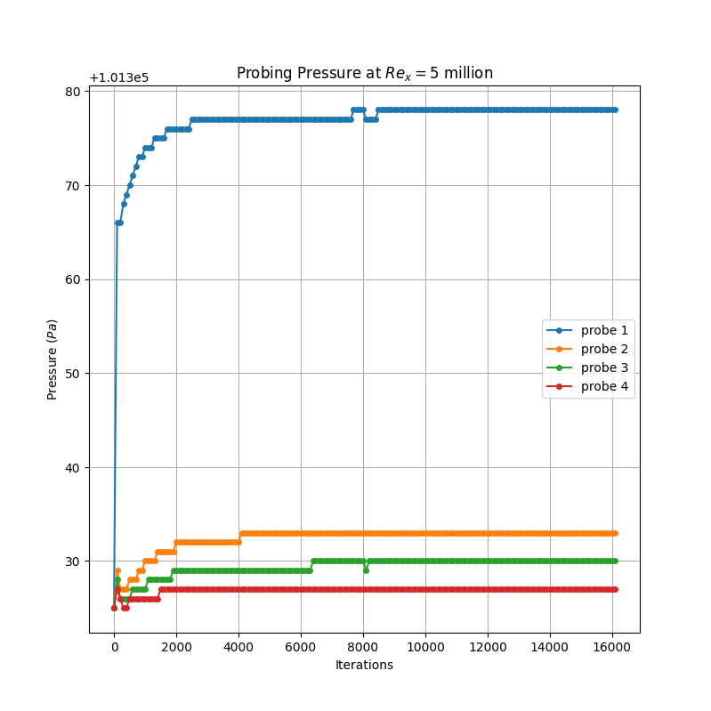
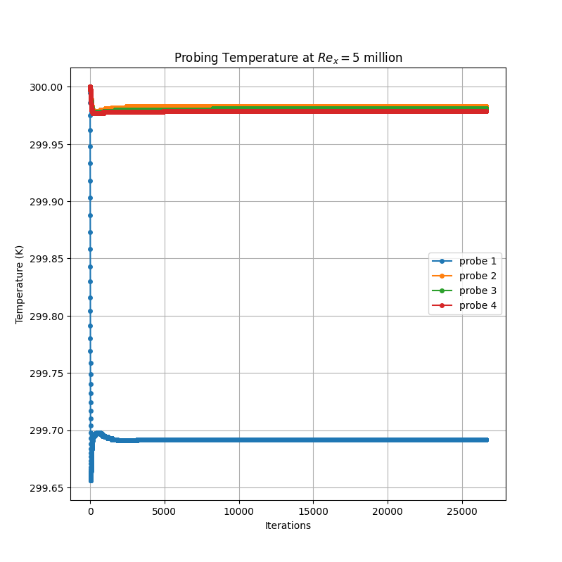

# madvadi.github.io
Portfolio of Cenk Tekin CFD Projects

Introduction: This is a presentation of a number of CFD projects, in which, I've be using to keep my skills up to date with advance in OpenFOAM 13 and CFD in general.

1.) Lid-cavity Demostration
To verfificate and validate my own CFD skills in setting up, running, and post-processing the results, I had a go at creating a simulation which I can easily validate agaist well estabished results from Ghia, Ghia, and Shin, 1982.
The model is a 2D square cavity, of unit dimensions (1m x 1m), with a Newtonian fluid having a lid being.
The goal is to see the velocity porfile is at half way along the unit cavity with a Reynolds number of 100 with a base line mesh of grid size, 129 x 129, and validate the results agaist my source.
With setting the reference pressure to 0 at the bottom left concer of the domain, I've set the boundary conditions as:

*Figure 1: The baseline mesh with the boundary conditions highlighted.*

With the initial field for pressure being set to a uniform 0, for velocity, a uniform 0 m/s in all direction, as seen in Figure 1.

The results compared with the vadlidation data in Ghia et al,1982 are presented in Figure 2:

*Figure 2: Comparison of normalized horizontal velocity (Ux) along the vertical centerline (x=0.5) against Ghia et al. (1982) benchmark data.*

Verification of Results

For the sake of verification, 4 probes where placed at locations along the vertical line in the centre of the cavity (x = 0.5 m) to measure the change in velocity and pressure.
Probe 1: y = 0.0 (m), Probe 2: y = 0.25 (m), Probe 3: y = 0.5 (m), Probe 4: y = 0.75 (m).

The data in Figure 3 and 4 shows that the Velocities and Pressure converage in a value. The residuals for both velocity and pressure also drop down several orders of magnitude, supporting the case that the simulation has convergence as can be seen in Figures 5 and 6.

*Figure 3: Velocity X Probes data at 4 probes over 4000 iterations.*

*Figure 4: Pressure Probes data at 4 probes over 4000 iterations.*

*Figure 5: Velocity X residual over 4000 iterations.*

*Figure 6: Pressure residual over 4000 iterations.*

*Figure 7: Convergance Mesh comparing 129 x129, 258 x 258, and 516 x 516 grid sizes.*

In Figure 7, shows that the results from all levels of refinement do not change significantly at all and with the error tabled in Table 1.

| Mesh Resolution | Total Cells | Max $U_x$ | % Change |
| :--- | :--- | :--- | :--- |
| 129 x 129 | 16,641 | -0.216 | — |
| 258 x 258 | 66,564 | -0.217 | 0.463% |
| 516 x 516 | 266,256 | -0.216 | 0.175% |

*Table 1, Convergance Mesh error when refined results are compared with the 129 x 129 mesh results.*

Conclusion 

From the results, we can see that the results from the Lid-Cavity simulation have been verificated and validated agaist Ghia et al. 1982 paper for a Reynolds number of 100.

Subsonic Turbulent Boundary Layer over a Flate Plate with a Compressible Pressure Solver

In CD nozzle, a high temperature and pressure subsonic flow is converted to supersonic before being exhusted from the engine. A high-fidenlity simulation must remain stable across 2 flow regimes, i.e. subsonic and supersonic, while capaturing what is happening at the wall of the nozzle, e.g. wall temperature. Uisng a Density-based solver in the subsonic section of the CD nozzle is hard to keep stable, and therefore, use of a pressure based solver to produce a internal internal field for that section of the nozzle is used.  I produced 2 unit cases using a zero pressure gradient flate plate simulations in compressible, subsonic, turbulent flow using the k-omega SST and Spalart-Allmaras.
Nasa Turbulent Modelling Resource provides a validation case for my simulation to be compared against, which can be found at https://tmbwg.github.io/turbmodels/flatplate_val.html.

The baseline mesh that is used is a 175 by 90 grid size with the boundary conditions, as seen in Figure 8.

*Figure 8: Mesh with 175 x 90 and the boundary conditions.*

For these turbulents models, it is important that the mesh near the wall is under y+ = 1 in order to resolve the visous sub-layer. Using the calcualted value of y coordiante for y+ = 1, I used a simple gradient ratio for bunching up the nodes along the y axis.

### Case using Spalart-Allmaras

For the Spalart-Allmaras model, I used set the inlet for $$\tilde{\nu} = \nu*3 = 4.7e-05 \frac{m^2}{s}$$ and let $\nu_t$=0 at the inlet, so it can be calculated. 

### Verification

*Figure 9: Convergence history of velocity residuals for the SA model on the coarse mesh.*

*Figure 10: Convergence history of pressure residuals for the SA model on the coarse mesh.*

*Figure 11: Velocity profiles extracted from the 4 probe locations across the control volume domain using the SA model on the coarse mesh.*

*Figure 12: Pressure distributions extracted from the 4 probe locations across the control volume domain using the SA model on the coarse mesh.*

*Figure 13: Temperature profiles extracted from the 4 probe locations across the control volume domain using the SA model on the coarse mesh.*

*Figure 14: Convergence history of velocity residuals for the SA model on the medium mesh.*

*Figure 15: Convergence history of pressure residuals for the SA model on the medium mesh.*

*Figure 16: Velocity profiles extracted from the 4 probe locations across the control volume domain using the SA model on the medium mesh.*

*Figure 17: Pressure distributions extracted from the 4 probe locations across the control volume domain using the SA model on the medium mesh.*

*Figure 18: Temperature profiles extracted from the 4 probe locations across the control volume domain using the SA model on the medium mesh.*

*Figure 19: Convergence history of velocity residuals for the SA model on the fine mesh.*

*Figure 20: Convergence history of pressure residuals for the SA model on the fine mesh.*

*Figure 21: Velocity profiles extracted from the 4 probe locations across the control volume domain using the SA model on the fine mesh.*

*Figure 22: Pressure distributions extracted from the 4 probe locations across the control volume domain using the SA model on the fine mesh.*

*Figure 23: Temperature profiles extracted from the 4 probe locations across the control volume domain using the SA model on the fine mesh.*

*Figure 24: Local skin friction coefficient distribution along the surface calculated with the SA model.*

*Figure 25: Dimensionless boundary layer velocity profile ($u^+$ vs $y^+$) plotted against the theoretical law of the wall using the SA model.*

*Figure 26: Development of the momentum thickness Reynolds number ($Re_\theta$) along the streamwise direction ($X$) for the SA model.*

The GCI error from all 3 meshes is calculated to be 1.7%.
### Validation
Validation
### Conclusion
Conclusion

### Case using K $$\omega$$ SST

For the k-$$\omega$$ SST case, following initial conditions where set, using $$k = \frac{3}{2} (UI)^2$$, where I is the turbulent intensity, set to I = 0.039, and $$\epsilon= C_{\mu}^(3/4) \frac{k^(3/2)}{L}$$, L ~ 0.07$$\delta$$, where $$\delta$$ is the boundary layer thickness, which is estimated to be 0.029 meters using reference (,), $$\nu_{T} = C_{\nu}\frac{k^2}{\epsilon}=2894.3$$.

### Verification

*Figure 27: Convergence history of velocity residuals for the k-omega SST model on the coarse mesh.*

*Figure 28: Convergence history of pressure residuals for the k-omega SST model on the coarse mesh.*

*Figure 29: Velocity profiles extracted from the 4 probe locations across the control volume domain using the k-omega SST model on the coarse mesh.*

*Figure 30: Pressure distributions extracted from the 4 probe locations across the control volume domain using the k-omega SST model on the coarse mesh.*

*Figure 31: Temperature profiles extracted from the 4 probe locations across the control volume domain using the k-omega SST model on the coarse mesh.*

*Figure 32: Convergence history of velocity residuals for the k-omega SST model on the medium mesh.*

*Figure 33: Convergence history of pressure residuals for the k-omega SST model on the medium mesh.*

*Figure 34: Velocity profiles extracted from the 4 probe locations across the control volume domain using the k-omega SST model on the medium mesh.*

*Figure 35: Pressure distributions extracted from the 4 probe locations across the control volume domain using the k-omega SST model on the medium mesh.*

*Figure 36: Temperature profiles extracted from the 4 probe locations across the control volume domain using the k-omega SST model on the medium mesh.*

*Figure 37: Convergence history of velocity residuals for the k-omega SST model on the fine mesh.*

*Figure 38: Convergence history of pressure residuals for the k-omega SST model on the fine mesh.*

*Figure 39: Velocity profiles extracted from the 4 probe locations across the control volume domain using the k-omega SST model on the fine mesh.*

*Figure 40: Pressure distributions extracted from the 4 probe locations across the control volume domain using the k-omega SST model on the fine mesh.*

*Figure 41: Temperature profiles extracted from the 4 probe locations across the control volume domain using the k-omega SST model on the fine mesh.*

*Figure 42: Local skin friction coefficient distribution along the surface calculated with the k-omega SST model.*

*Figure 43: Dimensionless boundary layer velocity profile ($u^+$ vs $y^+$) plotted against the theoretical law of the wall using the k-omega SST model.*

*Figure 44: Development of the momentum thickness Reynolds number ($Re_\theta$) along the streamwise direction ($X$) for the k-omega SST model.*

### Validation
Validation
### Conclusion
Conclusion
